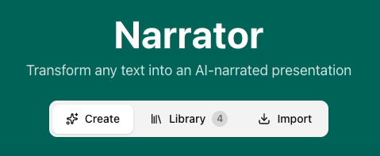

# Narrator

Transform any text into AI-narrated presentations with natural voice synthesis.




## Features

- **AI-Powered Slide Generation** - Claude or GPT-4 structures your content into presentation slides
- **Natural Voice Synthesis** - OpenAI TTS with 6 voice options (Alloy, Nova, Shimmer, Echo, Onyx, Fable)
- **Full Slide Editing** - Add, remove, and reorder slides with drag-and-drop
- **Bullet Management** - Add and remove bullet points per slide
- **Presentation Library** - Save presentations locally with IndexedDB persistence
- **Import/Export** - Share presentations via `.narrator` file format
- **Presentation Viewer** - Full-screen playback with auto-advance and captions
- **Session Recovery** - Auto-save drafts and recover interrupted sessions
- **URL Routing** - Shareable hash-based URLs for each app state
- **Accessible by Default** - Built on Radix UI primitives for WCAG compliance

## Tech Stack

| Layer       | Technology                     |
| ----------- | ------------------------------ |
| Framework   | Next.js 16 (App Router)        |
| Language    | TypeScript 5                   |
| Styling     | Tailwind CSS 4                 |
| Components  | ShadCN/UI (Radix primitives)   |
| State       | Zustand                        |
| Animations  | Framer Motion                  |
| Drag & Drop | @dnd-kit                       |
| Testing     | Vitest + React Testing Library |
| AI          | Claude API, OpenAI API         |

## Quick Start

```bash
# Install dependencies
npm install

# Copy environment template
cp .env.example .env.local

# Add your API keys to .env.local
# ANTHROPIC_API_KEY=your_key_here
# OPENAI_API_KEY=your_key_here

# Start development server
npm run dev
```

Open [http://localhost:3000](http://localhost:3000) to use the app.

## Project Structure

```
src/
├── app/
│   ├── api/
│   │   ├── generate-slides/    # Claude/GPT-4 slide generation
│   │   └── generate-audio/     # OpenAI TTS
│   ├── layout.tsx              # Root layout with Toaster
│   └── page.tsx                # Main SPA entry with routing
├── components/
│   ├── ui/                     # ShadCN components
│   ├── home-tabs/              # Create, Library, Import tabs
│   ├── input-state/            # Content input, style selector
│   ├── preview-state/          # Slide editor, voice selector
│   ├── viewer-state/           # Presentation playback
│   ├── export-import/          # .narrator file handling
│   └── states/                 # State wrapper components
└── lib/
    ├── store.ts                # Zustand state management
    ├── indexed-db.ts           # IndexedDB persistence layer
    ├── types.ts                # TypeScript definitions
    ├── audio/                  # Audio provider context
    └── hooks/                  # Custom React hooks
```

## Application Flow

```
┌──────────────────────────────────────────────────────────────────────────────┐
│                                   HOME                                       │
│                                                                              │
│   ┌──────────┐    ┌──────────┐    ┌──────────┐                               │
│   │  Create  │    │  Library │    │  Import  │     ← Tabs                    │
│   │  #/      │    │ #/library│    │ #/import │                               │
│   └────┬─────┘    └────┬─────┘    └────┬─────┘                               │
│        │               │               │                                     │
│        ▼               ▼               ▼                                     │
│   [Generate]      [Load saved]    [Import file]                              │
│                                                                              │
└────────┬───────────────┴───────────────┴─────────────────────────────────────┘
         │
         ▼
┌──────────────────────────────────────────────────────────────────────────────┐
│                              PREVIEW  #/preview                              │
│                                                                              │
│   • Edit slides (drag-and-drop reorder)                                      │
│   • Edit titles, bullets, scripts                                            │
│   • Select voice                                                             │
│   • Generate audio                                                           │
│   • Save to library                                                          │
│   • Export .narrator file                                                    │
│                                                                              │
└────────┬─────────────────────────────────────────────────────────────────────┘
         │
         ▼
┌──────────────────────────────────────────────────────────────────────────────┐
│                              VIEWER  #/present                               │
│                                                                              │
│   • Full-screen presentation                                                 │
│   • Auto-advance with audio                                                  │
│   • Keyboard navigation                                                      │
│   • Toggleable captions                                                      │
│   • Playback speed control                                                   │
│                                                                              │
└──────────────────────────────────────────────────────────────────────────────┘
```

## URL Routes

| Route       | State   | Description                     |
| ----------- | ------- | ------------------------------- |
| `#/`        | Home    | Create new presentation         |
| `#/library` | Home    | Browse saved presentations      |
| `#/import`  | Home    | Import .narrator file           |
| `#/preview` | Preview | Edit and configure presentation |
| `#/present` | Viewer  | Full-screen presentation mode   |

## Keyboard Shortcuts (Viewer)

| Key      | Action           |
| -------- | ---------------- |
| `←`      | Previous slide   |
| `→`      | Next slide       |
| `Space`  | Play/Pause audio |
| `Escape` | Exit to preview  |

## Environment Variables

| Variable            | Required | Description                                  |
| ------------------- | -------- | -------------------------------------------- |
| `ANTHROPIC_API_KEY` | One of   | Claude API for slide generation (preferred)  |
| `OPENAI_API_KEY`    | Either   | OpenAI for TTS and fallback slide generation |

## Deployment

Deploy to Netlify or Vercel:

```bash
npm run build
```

Set environment variables in your hosting dashboard:

- `ANTHROPIC_API_KEY` - For Claude slide generation
- `OPENAI_API_KEY` - For TTS and fallback slide generation

## Testing

```bash
npm run test        # Watch mode
npm run test:run    # Single run
```

## License

MIT
